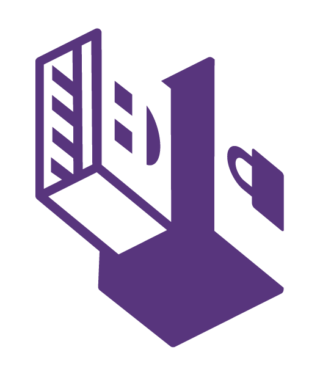
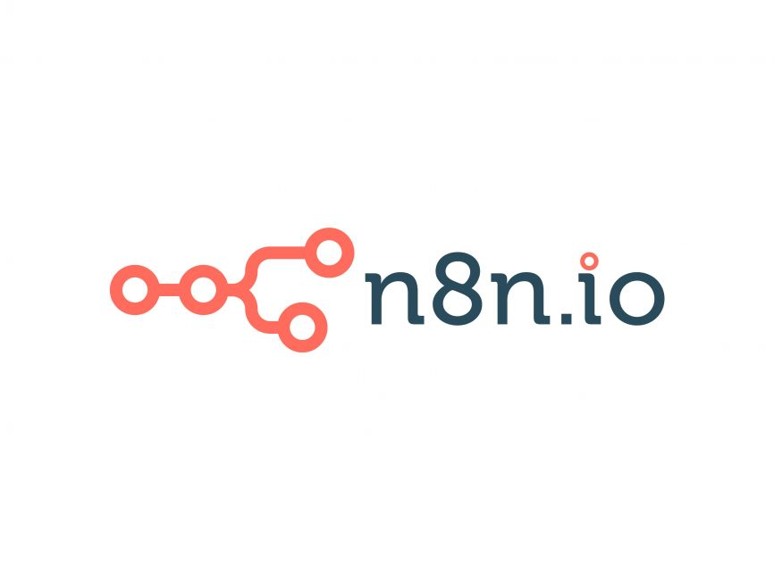
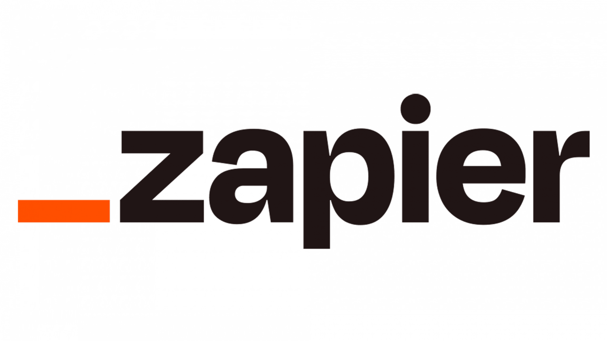

# Degree:
* WGU - Bachelor of Science in Computer Science

# Certified:
* LPI - Linux Essentials
* CompTIA - Data+
* CompTIA - PenTest+

# Hackathons:
* QC Hack 2022 - IBM Finalist

# Core Languages:
| Python | Ruby | Java | Bash | PHP |
| --- | --- | --- | --- | --- |
|  |  |  |  |  |

# Python Stack:
| Pytorch | Selenium | Numpy | Pandas | Sklearn | OpenCV |
|----------|----------|----------|----------|----------|----------|
|  |  |  |  |  | |

# Database:
| MySQL | SQLite |
| --- | --- |
|  |  |

# Web Frameworks:
| Django | Ruby on Rails | Spring |
| --- | --- | --- |
|  |  |  |

# Markup languages:
| HTML | CSS | Markdown |
| --- | --- | --- |
|  |  |  |

# Hardware & Firmware: 
| Thinkpad X1 | Coreboot |
| --- | --- |
|  |  |

# OS:
| Windows 11 | Ubuntu | Kali Nethunter |
| --- | --- | --- | 
|  |  |  |

# Portable OS:
| WinToGO | Tails |
| --- | --- |
|  |  |

# Enviroments:
| WSL | Postman | Docker | VirtualBox |
| --- | --- | --- | --- |
|  |  |  |  |

# Automation
| n8n | Zapier |
| --- | --- |
|  |  |

# Version Control
| git |
| --- | --- |
|  |

<!--  -->

<!--
**vva1kerr/vva1kerr** is a ✨ _special_ ✨ repository because its `README.md` (this file) appears on your GitHub profile.

Here are some ideas to get you started:

- 🔭 I’m currently working on ...
- 🌱 I’m currently learning ...
- 👯 I’m looking to collaborate on ...
- 🤔 I’m looking for help with ...
- 💬 Ask me about ...
- 📫 How to reach me: ...
- 😄 Pronouns: ...
- ⚡ Fun fact: ...
-->
